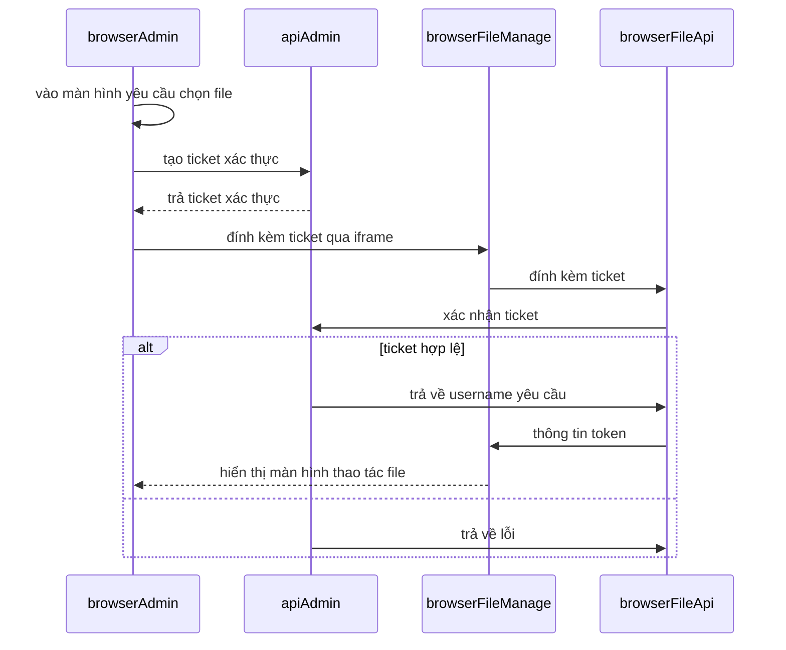

# Tích hợp
## flow


## thông tin đã có 
1. trả ticket xác thực
  ```
  curl --location 'https://tecs.vn/v1/api/manage/embed-ticket' \
  --header 'Authorization: Bearer '

  {
      "data": {
          "ticket": "GpWhy9fH1UAxW8VO4D2lHuesLoHyBHvMz20t7KMzqXs",
          "expiresIn": 30,
          "embedUrl": "https://file-manager.tecs.vn/embed/login?ticket=GpWhy9fH1UAxW8VO4D2lHuesLoHyBHvMz20t7KMzqXs"
      },
      "message": "",
      "code": ""
  }
  ```
2. xác nhận ticket
  ```
  curl --location 'https://tecs.vn/v1/api/manage/embed-ticket/verify' \
  --header 'X-Service-Key: file-manage-iam-service-key-2026' \
  --header 'Content-Type: application/json' \
  --data '{
      "ticket" : "GpWhy9fH1UAxW8VO4D2lHuesLoHyBHvMz20t7KMzqXs"
  }'

  Response 
  {
      "data": {
          "adminId": "a587bb8d-84c3-463a-ab05-eadf949e91a5",
          "userName": "manage",
          "fullName": "Quản trị viên",
          "roles": []
      },
      "message": "",
      "code": ""
  }
    
  ```
